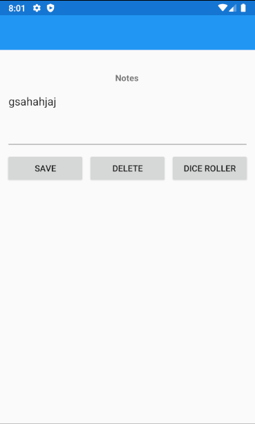
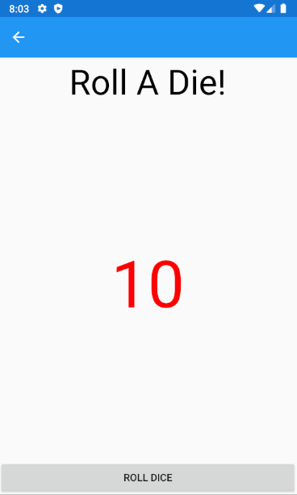

# Xamarin-Example

---
## Xamarin Application

The web application of 2 mobile application pages, built using Xamarin.

The first page allows the user to enter in notes and the will appear on the screen. There is a second page that has button that allows you to roll 2 dice and the result will be displayed in Red on the screen.

---

## Tools Used
Microsoft Visual Studio Community 2019

- C#
- Xamarin

---

## Getting Started

Clone this repository to your local machine.

```
$ git clone https://github.com/JungDefiant/Xamarin-Example.git
```
Once downloaded, you can either use Visual Studio 2019 (or greater) to build the Xamarin application. The solution file is located in the Xamarin-Example subdirectory at the root of the repository.

---

## Visuals TODO

### Homepage


### Homepage With Notes


### Dice Roller Page



## Change Log
1.2: Dice Roller Page built
1.1: Notes Page built
1.0: Repo and README built

---

## Authors
- Bade Habib
- Bryant Davis
- Trevor Stubbs


